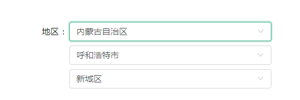
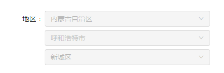
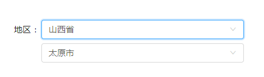

# react-antd-area-picker
A npm package to pick China area(3 levels) using react and antd. This is used in antd Form component.

## Getting Started

These instructions will get you a copy of the project up and running on your local machine for development and testing purposes. See deployment for notes on how to deploy the project on a live system.


### Installing

Install the package using npm or yarn

```
npm install react-antd-area-picker
```
or
```
yarn add react-antd-area-picker
```

### How to use

Use it as if antd component.

A simple example:
```
import AreaPicker from "react-antd-area-picker";
import { Form,Row,Col,Button } from 'antd';
const FormItem = Form.Item;

...
<Form onSubmit={this.handleSubmit}>
  <FormItem label={< span > 地区 </span>}>
    <Row gutter={8}>
      <Col span={24}>
      {getFieldDecorator("area", {
        rules: []
      })(<AreaPicker disabled={this.state.disabled}/>)}                  
      </Col>
    </Row>
  </FormItem>
</Form>  
...
```


## Available props

### disabled
Toggole disable of this component:
```
<AreaPicker disabled={true}/>
```

### value
Set default value of get value use onChange function of this component.
- data format
The value should to be a array and each of its component is a object which has two keys: code and value. The code key is the code of the province/city/district in [area-data](https://github.com/dwqs/area-data), value is the Chinese name of the province/city/district.
A example:
```
[
  {
    code: '330000',
    value: '浙江省'
  }, 
  {
    code: '330100',
    value: '杭州市'
  }, 
  {
    code: '330106',
    value: '西湖区'
  }
]
```
- how to use
If you are setting the default value of your component, then the key 'value' is unnecessary. But the value returned form onChange function has the key 'value'.
```
<AreaPicker value={[
  {code: '330000'},
  {code: '330100'},
  {code: '330106'}
  ]} onChange={e=>console.log(e)}/>
```
### level
```
<AreaPicker level={2}/>
```


## Authors

* **xiaobaihaha** - [xiaobaiha'github](https://github.com/xiaobaiha)

